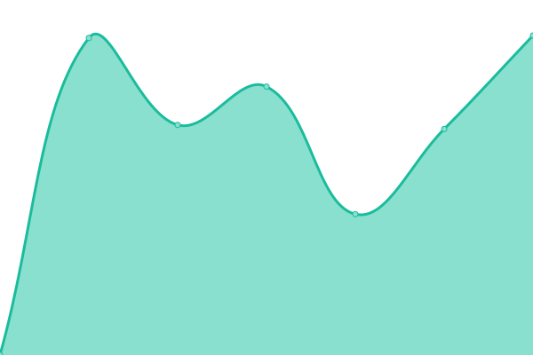
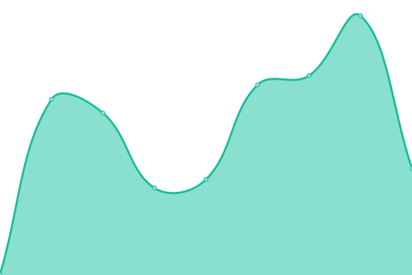

# [📈 Live Status](https://generationsbroadcasting.github.io/upptime): <!--live status--> **🟩 All systems operational**

This repository contains the open-source uptime monitor and status page for [generationsbroadcasting](GenerationsBroadcasting.com), powered by [Upptime](https://github.com/upptime/upptime).

With [Upptime](https://upptime.js.org), you can get your own unlimited and free uptime monitor and status page, powered entirely by a GitHub repository. We use [Issues](https://github.com/generationsbroadcasting/upptime/issues) as incident reports, [Actions](https://github.com/generationsbroadcasting/upptime/actions) as uptime monitors, and [Pages](https://generationsbroadcasting.github.io/upptime) for the status page.

<!--start: status pages-->
<!-- This summary is generated by Upptime (https://github.com/upptime/upptime) -->
<!-- Do not edit this manually, your changes will be overwritten -->
<!-- prettier-ignore -->
| URL | Status | History | Response Time | Uptime |
| --- | ------ | ------- | ------------- | ------ |
|  [Generations Broadcasting](https://generationsbroadcasting.com) | 🟩 Up | [generations-broadcasting.yml](https://github.com/generationsbroadcasting/upptime/commits/HEAD/history/generations-broadcasting.yml) | 

 1095ms
     
 | 

<a href="https://generationsbroadcasting.github.io/upptime/history/generations-broadcasting">100.00%</a>
    

|  [GBCStories](https://gbcstories.com) | 🟩 Up | [gbc-stories.yml](https://github.com/generationsbroadcasting/upptime/commits/HEAD/history/gbc-stories.yml) | 

 130ms
     
 | 

<a href="https://generationsbroadcasting.github.io/upptime/history/gbc-stories">100.00%</a>
    

|  [Canvas](https://canvas.gbcstories.com) | 🟩 Up | [canvas.yml](https://github.com/generationsbroadcasting/upptime/commits/HEAD/history/canvas.yml) | 

 122ms
     
 | 

<a href="https://generationsbroadcasting.github.io/upptime/history/canvas">100.00%</a>
    

|  [GBCTV](https://gbctv.net/wp-admin) | 🟩 Up | [gbctv.yml](https://github.com/generationsbroadcasting/upptime/commits/HEAD/history/gbctv.yml) | 

 2444ms
     
 | 

<a href="https://generationsbroadcasting.github.io/upptime/history/gbctv">99.10%</a>
    

|  [Google](https://www.google.com) | 🟩 Up | [google.yml](https://github.com/generationsbroadcasting/upptime/commits/HEAD/history/google.yml) | 

 87ms
     
 | 

<a href="https://generationsbroadcasting.github.io/upptime/history/google">100.00%</a>
    

|  [Amazon S3](https://s3.console.aws.amazon.com/) | 🟩 Up | [amazon-s3.yml](https://github.com/generationsbroadcasting/upptime/commits/HEAD/history/amazon-s3.yml) | 

 397ms
     
 | 

<a href="https://generationsbroadcasting.github.io/upptime/history/amazon-s3">100.00%</a>
    

|  [Linode](https://linode.com) | 🟩 Up | [linode.yml](https://github.com/generationsbroadcasting/upptime/commits/HEAD/history/linode.yml) | 

 2530ms
     
 | 

<a href="https://generationsbroadcasting.github.io/upptime/history/linode">100.00%</a>
    

|  [Sucuri (GoDaddy Host)](https://sucuri.net) | 🟩 Up | [sucuri-go-daddy-host.yml](https://github.com/generationsbroadcasting/upptime/commits/HEAD/history/sucuri-go-daddy-host.yml) | 

 100ms
     
 | 

<a href="https://generationsbroadcasting.github.io/upptime/history/sucuri-go-daddy-host">100.00%</a>
    

|  [Namecheap](https://namecheap.com) | 🟩 Up | [namecheap.yml](https://github.com/generationsbroadcasting/upptime/commits/HEAD/history/namecheap.yml) | 

 514ms
     
 | 

<a href="https://generationsbroadcasting.github.io/upptime/history/namecheap">100.00%</a>
    

|  [Vimeo](https://vimeo.com) | 🟩 Up | [vimeo.yml](https://github.com/generationsbroadcasting/upptime/commits/HEAD/history/vimeo.yml) | 

 437ms
     
 | 

<a href="https://generationsbroadcasting.github.io/upptime/history/vimeo">100.00%</a>
    

|  [YouTube](https://youtube.com) | 🟩 Up | [you-tube.yml](https://github.com/generationsbroadcasting/upptime/commits/HEAD/history/you-tube.yml) | 

 387ms
     
 | 

<a href="https://generationsbroadcasting.github.io/upptime/history/you-tube">100.00%</a>
    

<!--end: status pages-->

[**Visit our status website →**](https://generationsbroadcasting.github.io/upptime)

## 📄 License

- Powered by: [Upptime](https://github.com/upptime/upptime)
- Code: [MIT](./LICENSE) © [generationsbroadcasting](GenerationsBroadcasting.com)
- Data in the `./history` directory: [Open Database License](https://opendatacommons.org/licenses/odbl/1-0/)
